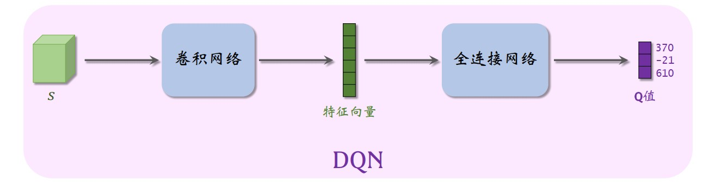
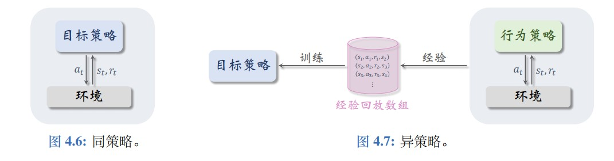
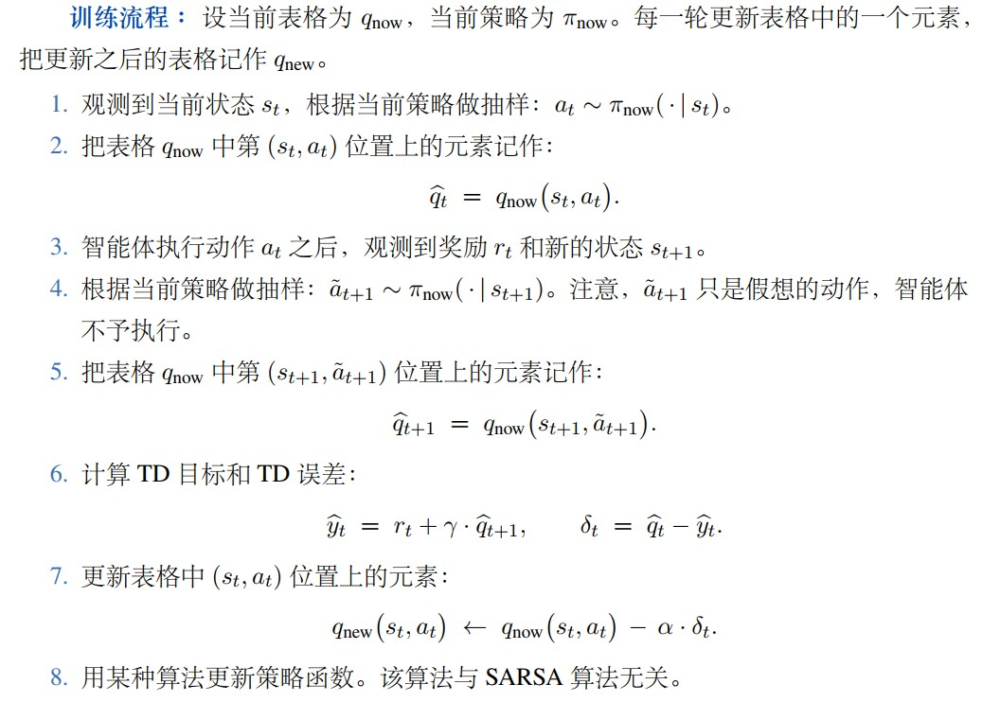
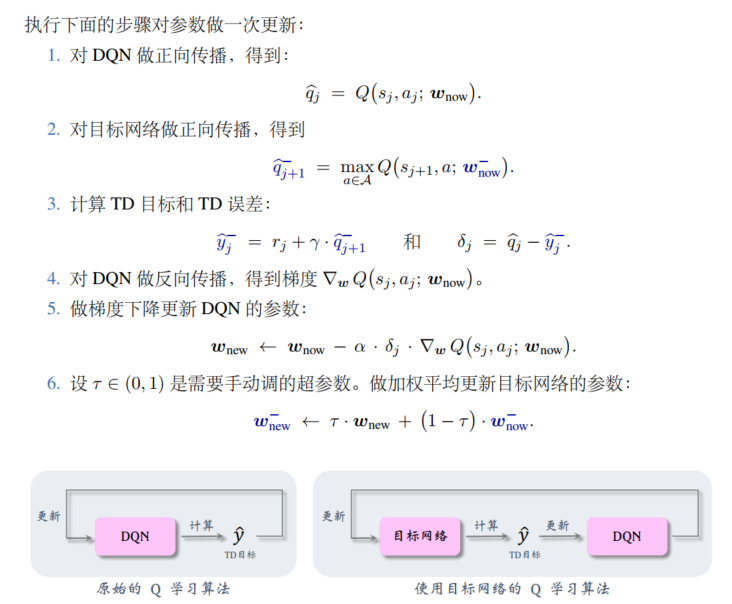
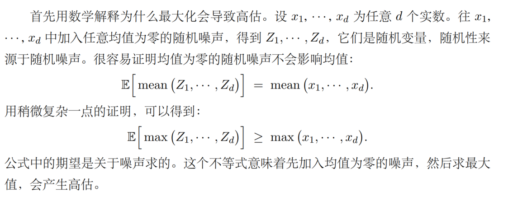
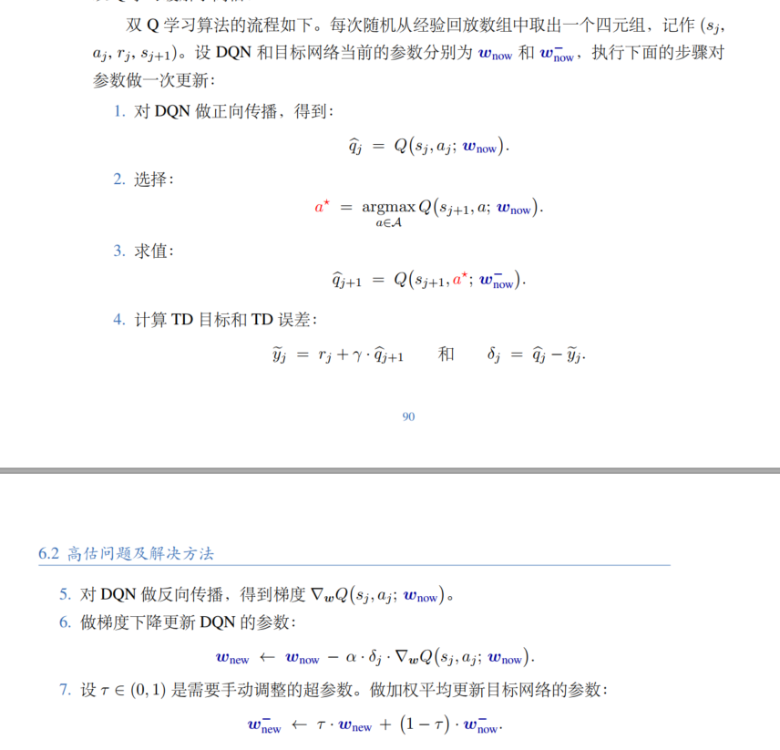
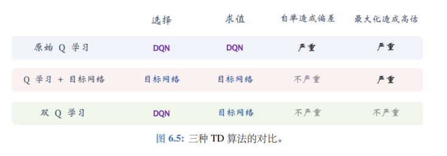

# 价值学习

## DQN与Q学习

最优动作价值函数的近似：DQN(deep Q network) \
***对于DQN结构，通常为输入状态空间为无限大，而动作空间为有限大情况*** \
记为$Q(s,a;\boldsymbol w)$ ，其中$w$为神将网络中参数
**DQN结构**：DQN为神经网络结构，输入为状态$s$，输出为离散动作空间上每个动作的$Q$值

DQN的梯度：
$$
\nabla_w Q(s,a;\boldsymbol{w}) \triangleq \frac{\partial Q(s,a;\boldsymbol{w})}{\partial w}
$$

### 时间差分算法(TD)
TD算法:
* Q学习算法(学习最优动作价值函数$Q_\star$)
* SARSA算法(学习动作价值函数$Q_\pi$)

***
训练DQN的常用算法 
* TD目标是含实际成分的预测值 \
  DQN预测值和TD目标区别：DQN预测值为$s_t,a_t$为变量的预测值，无事实成分，TD目标为已知$r_t$的预测值
* TD误差$\delta$即为模型估计与真是观测之差
* TD算法可利用**未达成目标的部分事实信息**参与训练，以基于部分事实的TD目标$\hat{y}$对模型进行修正，使得损失函数$L(\omega)=\frac{1}{2}(\hat{q}-\hat{y})^2$减小 
* DQN学习的是最佳动作函数$Q_\star$
***
* 算法推导 \
  回报
  $$
  U_t=\sum_{k=t}^n \gamma^{k-t} \cdot R_k 
  $$
  故
  $$
  U_t=R_t+\gamma \cdot U_{t+1} 
  $$
  最优动作价值函数可写成最优贝尔曼方程一种形式
  $$
  Q_{\star}(s_t,a_t)=\mathbb{E}_{S_{t+1}\sim p(\cdot | s_t,a_t)} \left[R_t+\gamma \cdot \max Q_{\star}(S_{t+1},A)\right]
  $$
  其中$Q_{\star}(s_t,a_t)$为$U_t$期望，$\max Q_{\star}(S_{t+1},A)$为$U_{t+1}$期望 \
  当智能体执行动作$a_t$后，可利用状态转移函数计算新状态$s_{t+1}$。同时奖励$R_t$最多只依赖于$S_t,A_t,S_{t+1}$，故此时确定四元组
  $$
  \left(s_t,a_t,r_t,s_{t+1}\right)
  $$
  进而可计算出
  $$
  r_t+\gamma\cdot\max_{a\in A}Q_{\star}(s_{t+1},a)
  $$
  可视为$U_t$期望的蒙特卡洛近似，即
  $$
  \bm{Q_{\star}(s_{t},a_t) \approx r_t+\gamma\cdot\max_{a\in A}Q_{\star}(s_{t+1},a)}
  $$
  **即此时忽略状态转移函数计算所得概率较小的$s_{t+1}$的情况，仅以最大概率新状态估算回报期望**
  ***
  在神经网络中$Q_{\star}(s,a)$替换为神经网络$Q(s,a;\omega)$
  $$Q(s_t,a_t;\omega)\approx r_t+\gamma\cdot\max_{a\in A}Q(s_{t+1},a;\omega)$$
  损失函数
  $$L(\omega)=\frac{1}{2}[Q(s_t,a_t;\omega)-y]$$
  进而更新参数
  $$\omega=\omega-\alpha \cdot \nabla_{\omega} L(\omega)$$
***
* 训练流程
  * 收集训练数据：
    常采用的策略函数控制智能体与环境交互---$\epsilon-greedy$策略
    $$
    a_t = 
    \begin{cases} 
    \begin{align}
    &argmax_a Q(s_t,a;\omega),  &以概率(1-\epsilon) \nonumber\\
    &均匀抽取A中一个动作，         &以概率\epsilon \nonumber
    \end{align}
    \end{cases}
    $$
    智能体在一局游戏中轨迹为n个四元组$(s_t,a_t,r_t,s_{t+1})$，称为经验回放数组，设当前DQN参数为$\omega_{now}$
  * 更新DQN参数$\omega$ \
    随机从经验回放数组中取一个四元组，记为$(s_j,a_j,r_j,s_{j+1})$
    1. 对DQN正向传播，得到Q值
    $$\hat{q_j}=Q(s_j,a_j;\omega_{now})，\hat{q_{j+1}}=\max_{a\in A}Q(s_{j+1},a;\omega_{now})$$
    2. 计算TD目标和TD误差
    $$\hat{y_j}=r_j+\gamma\cdot \hat{q_{j+1}}，\delta_j=\hat{q_j}-\hat{y_j}$$
    3. 对DQN做反向传播，得到梯度
    $$\hat{g_j}=\nabla_{\omega}Q(s_j,a_j;\omega_{now})$$
    4. 做梯度下降更新DQN的参数
    $$\omega_{new}\leftarrow \omega_{now}-\alpha\cdot\delta_j\cdot g_j$$
训练中，收集数据与更新DQN参数可同时进行，也可每执行一个动作后更新$\omega$

### 策略(on-policy)与异策略(off-policy)
行为策略：收集数据时采取的策略 \
目标策略：最后训练得到的策略函数，确定性策略$a=\argmax_a Q(s_t,a;w\omega)$

**同策略**：行为策略与目标策略相同，即收集数据时即使用目标策略进行决策；\
**异策略**：行为策略和目标策略不同（如DQN中可以用任意策略收集经验即$\epsilon-greedy$,行为策略具有随机性可更好探索更多状态）

## SARSA算法
### 表格形式的SARSA算法
*状态空间S和动作空间A都是有限集，每个表格与一个策略函数$\pi$对应*

**算法推导**: \
对贝尔曼方程
$$
Q_{\pi}(s_t,a_t)=\mathbb{E}_{S_{t+1},A_{t+1}} \left[R_t+\gamma \cdot Q_{\pi}(S_{t+1},A_{t+1})|S_t=s_t,A_t=a_t\right]
$$
* 方程左侧$Q_{\pi}(s_t,a_t)$可由$q(s_t,a_t)$近似，$q(s_t,a_t)$在表格中查出
* 给定$s_t$与$a_t$,环境给出奖励$r_t$和新状态$s_{t+1}$。基于$s_{t+1}$做随机抽样可得到新动作
  $$\hat{a}_{t+1}\sim \pi(\cdot|s_{t+1})$$
* 求得TD目标
  $$\hat{y}_t \triangleq r_t + \gamma \cdot q(s_{t+1},\hat{a}_{t+1})$$
* 更新表格$(s_t,a_t)$位置上的元素
  $$q(s_t,a_t)\leftarrow (1-\alpha) \cdot q(s_t,a_t)+\alpha \cdot \hat{y}_t$$
SARSA算法依赖于策略函数$\pi$，$\hat{a}_{t+1}$根据策略函数$\pi(\cdot|s_{t+1})$抽样得到

<<<<<<< HEAD
### 神经网络形式的SARSA算法
*当状态空间S为无限集时，考虑使用神经网络形式* \
**算法流程**:\

## 一些总结
### SARSA与Q学习的区别:
**SARSA** \
是对当前策略的评估方法，即对给定策略得到每个动作的价值函数。（*类似于动态规划方法中的策略评估步骤，但不是采用迭代收敛方法，而采用类似于蒙特卡洛的TD方法进行近似计算*） ，而想要获得最优动作价值函数需要配合策略优化方法。同时，更新时采用的行为策略即为目标策略，即训练数据来自于目标策略(on-policy) \
\
**Q学习** \
是直接获得最优价值函数，采用经验回放数组进行训练。由于行为策略与目标策略不一致，实际上在某一状态下，行为策略采用与目标策略不同时，也是在尝试对目标策略的优化过程（是否存在回报更高的其他选择？），即Q学习在同时进行着策略评估与策略优化两个过程。

### TD算法与蒙特卡洛、动态规划区别：
**动态规划**：\
个人理解，动态规划所得的收敛结果是绝对严谨的结果。动态规划包括策略评估与策略优化两个大步骤，由于最优价值函数（无论状态价值或动作价值）为贝尔曼方程的不动点，最终迭代结果会收敛至最优价值函数，策略也会收敛至最优策略。**但该方法存在两个弊端**：其一，当状态较多时迭代久，收敛慢；其二，用贝尔曼方程要求我们知晓状态转移函数$p(s_{t+1},r_t|s_t,a_t)$，如此才能求期望，但实际情况下这一函数不一定已知。\
\
**蒙特卡洛**:\
蒙特卡洛方法可解决动态规划的两个弊端，且根据大数定理，当样本无穷大时，训练结果收敛于最优结果（即蒙特卡洛方法具有**无偏性**）。但蒙特卡洛方法同样存在问题。首先，蒙特卡洛方法需要大量训练样本，而且这些样本是从开始到游戏结束的完整样本。这首先导致了结果**方差大**（回合越多，随机性越强）且**对训练样本的要求性更高**（未完成的尝试不能作为训练样本）。\
\
**TD算法**:\
TD算法结合以上两者优点，无需求期望而用采样结果近似期望，同时不需要完整的尝试结果，仅用一个回合结果的四元数组即可完成一次训练，由于随机变量减小，故该方法的方差小于蒙特卡洛方法。但同样存在问题：结果与实际有偏差，当神经网络输出存在偏差时，训练迭代结果也会存在偏差（**自举**带来的问题）。\
\
综上，还可以采用多步TD算法

## 高级技巧
### 优先经验回放
**普通经验回放**：从经验回放数组中**均匀**抽样得到样本用于训练 \
**优先经验回放**: 根据权重做**非均匀**随机采样用于训练 \
其中，抽样概率一般有两种取法
- 方法1:$p_j \propto |\delta_j|+\epsilon$（$\epsilon$为较小值避免抽烟概率为0）
- 方法2:$p_j \propto \frac{1}{rank(j)}$（其中rank(j)是$|\delta_j|$的序号，大的$|\delta_j|$序号小。
  
同时需调整学习率，抵消不同抽样概率造成的偏差
$$
\alpha_j=\frac{\alpha}{(b\cdot p_j)^\beta}
$$

基本原理：若预测值严重偏离真实价值（或TD目标，TD目标含部分真实成分），说明DQN对当前状态-动作的真实价值评估不准确，应给该四元组$(s_j,a_j,r_j.s_{j+1})$设置较高权重且快速学习当前样本（即提高权重并减小学习率）

### 高估问题
*DQN可能会高估真实的价值，且这种高估是非均匀的*

**高估原因及解决方法**：
1. **自举导致偏差传播**:
   $$\hat{y_j}=r_j+\gamma\cdot \max_{a_{j+1}\in A}Q(s_{j+1},a_{j+1};w)$$
   当对$Q(s_{j+1},a_{j+1};w)$高估或低估时，TD目标就会高估或低估，将该偏差传递下去

   **解决方法-目标网络**:
   计算TD目标时，采用另外一个网络估计下一状态的动作价值函数，该网络的参数与DQN参数相关但不相同
   
2. **最大化导致高估**:
   
   同样的，在$\hat{y_j}=r_j+\gamma\cdot \max_{a_{j+1}\in A}Q(s_{j+1},a_{j+1};w)$中，max也会将随机噪声最大化放大

   **解决方法-双Q学习(DDQN)** \
   

三种算法对比

