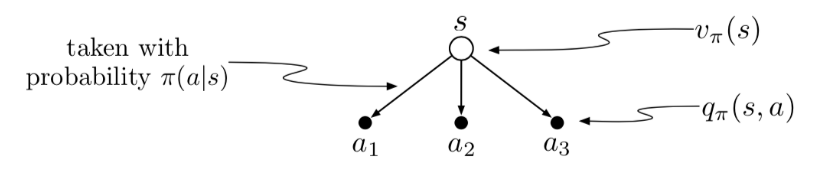
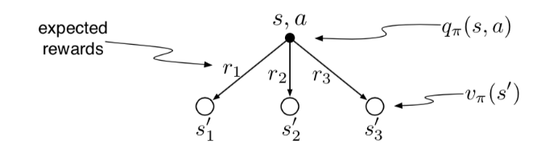
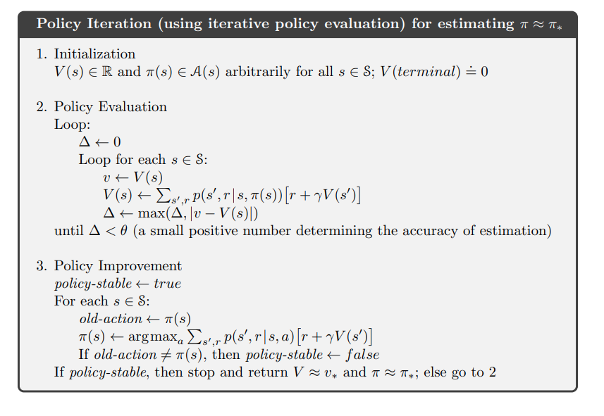
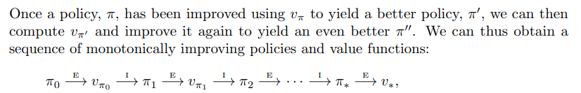
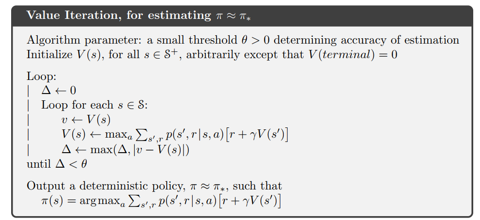
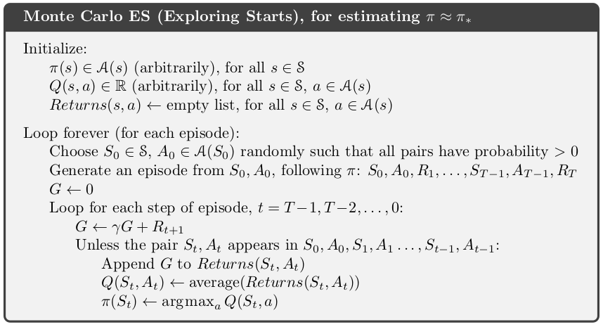

# 表格型求解方法

## ch2（非关联性任务）
*该部分中，任务是平稳的，最佳动作不随状态变化而变化*
### 动作选择规则
1. 贪心方法：每次选择具有最高估计值的动作
2. $\epsilon$-贪心方法：以$\epsilon$（很小）概率从所有动作中等概率随机做出选择，以$1-\epsilon$的概率选择最高估计值动作 \
两种方法对比：方法选择取决于任务情况--当收益噪声较大时，选择$\epsilon$-贪心方法可做更多尝试找到实际最优值；当噪声小时，贪心方法可更快找到最佳动作
3. 基于置信度上界(upper confidence bound, UCB)的动作选择方法
   $$A_t=argmax_a\left[Q_t(a)+c\sqrt\frac{\ln{t}}{N_t(a)}\right]$$
   其中$N_t(a)$表示时刻$t$之前动作a被选择的次数 \
   *优点*：$\epsilon$-贪心方法是一种盲目的选择，而该算法可尝试被选择次数少且价值估计较高的动作（更有潜力）\
   *缺点*：处理非平稳问题和较大状态空间存在困难

**平稳问题**：收益概率分布不随时间变化 \
对非平稳问题，$\epsilon$-贪心方法更有效

### 动作价值的估计
1. 平均值估计(**常用于平稳问题**)
   $$
   \begin{align}
   Q_{n+1}&=Q_n+\frac{1}{n}\left[R_n-Q_n\right] \nonumber\\
   &=\frac{R_1+R_2+...+R_{n}}{n} \nonumber
   \end{align}
   $$
   其中$Q_n$为一个动作被选择$n-1$次后它的估计的动作价值,$R_n$为这一动作被选择第n次后获得的收益\ 
   此时等价于$n$次尝试后的动作价值取平均值
2. 指数近因加权估计(**常用于非平稳问题**)
   $$
   \begin{align}
   Q_{n+1}&=Q_n+\alpha\left[R_n-Q_n\right] \nonumber\\
   &=\alpha R_n+(1-\alpha) Q_n \nonumber
   \end{align}
   $$
   其中步长$\alpha\in[0,1]$为常量
3. 对初始值无偏的指数近因加权平均(**适用更广**) \
   使用修正步长
   $$
   \begin{align}
   &\beta_n=\alpha/\overline{o}_n \nonumber\\
   &\overline{o}_n=\overline{o}_{n-1}+\alpha(1-\overline{o}_{n-1}) \nonumber
   \end{align}
   $$
   此时既可应用于非稳态过程且无偏

### 乐观初始值
对动作的初始预期值可设较大，当采用贪心方法时，无论哪一种动作被选择，实际收益低于预期收益，均会使得学习器对收益失望，进而选择其他动作（因而进行大量试探）

### 梯度赌博机算法
*（不估计动作价值，而利用偏好函数，使用softmax分布来以概率式方式选择更优动作）*\
**偏好函数**:$H_t(a)$越大，动作就越频繁被选择 \
对偏好函数使用$softmax$:
$$
Pr(A_t=a)=\frac{e^{H_t(a)}}{\sum_{b=1}^k e^{H_t(b)}}\triangleq\pi_t(a)
$$
$\pi_t(a)$可表示动作$a$在$t$时刻被选择概率
基于随机梯度上升，选择动作$A_t$并获得收益$R_t$后，偏好函数按如下方式更新:
$$H_{t+1}(A_t)=H_t(A_t)+\alpha(R_t-\overline{R}_t)(1-\pi_t(A_t)) \\
H_{t+1}(a)=H_t(a)-\alpha(R_t-\overline{R}_t)\pi_t(a), \forall a 
\neq A_t$$
其中$\alpha$为大于数，表示步长；$\overline{R}_t$是在时刻t内所有收益平均值（初始时刻各项均为0） \
*上式表示当收益$R_t$高于基准项$\overline{R}_t$时，未来选择$A_t$概率增加，其他动作概率下降。--该结论可等价于梯度上升的随机近似，使得期望收益最大化* 

### 整理
对非关联性任务，可采用方法：
* 动作价值估计
    * 贪心方法
    * $\epsilon$-贪心方法
    * UCB方法
* 梯度赌博机
***
## ch3 有限马尔科夫决策过程
### 马尔科夫框架（MDP）
*有限MDP中，状态、动作、收益的集合只有有限个元素* \
随机变量$R_t$与$S_t$有明确离散概率分布，且只依赖于前继状态和动作（此时认为状态具有马尔科夫性）。给定前继状态和动作时，$s'\in S$和$r\in R$在t时刻出现的概率为
$$p(s',r|s,a)=Pr\{S_t=s',R_t=r|S_{t-1}=s,A_{t-1}=a\}$$

### 回报、收益
两种强化学习任务：
* 分幕式任务（多个有限长度序列任务）
* 持续性任务（一个无限长序列任务）
统一定义回报为：
$$G_t=\sum_{k=t+1}^T \gamma^{k-t-1} R_k$$
上式允许$T=\infty$或$\gamma=1$
此外，存在递推公式：
$$G_t=R_{t+1}+\gamma G_{t+1}$$

### 策略与价值函数
**价值函数**：评估当前智能体在给定状态（或给定状态与动作）下有多好（回报的期望）\
**策略**($\pi$)：从状态到每个动作的选择概率之间的映射 \
*若对每个收益加上同一个常数c，任何状态下相对价值不受影响*

一些函数定义：
* **状态价值函数**：策略$\pi$下状态$s$的价值函数记为$v_\pi(s)$，即从状态$s$开始,智能体按照策略$\pi$进行决策获得的回报期望
   $$v_\pi(s)=\mathbb{E}_\pi \left[G_t|S_t=s\right]=\mathbb{E}_\pi\left[\sum_{k=0}^\infty \gamma^k R_{t+k+1}|S_t=s\right]$$

* **动作价值函数**：在策略$\pi$，状态$s$时采取动作$a$的价值记为$q_\pi(s,a)$，即根据策略$\pi$，从状态$s$开始，执行动作$a$后，所有决策序列的期望回报
  $$v_\pi(s,a)=\mathbb{E}_\pi \left[G_t|S_t=s,A_t=a\right]=\mathbb{E}_\pi\left[\sum_{k=0}^\infty \gamma^k R_{t+k+1}|S_t=s,A_t=a \right]$$

* **动作价值函数与状态价值函数关系**
  
   \
  由上图可推出：
  $$v_\pi(s)=\sum_a \pi(a|s)q_\pi(s,a)$$
   \
  由上图可推出：
  $$q_\pi(s,a)=\sum_{s',a} p(s',r|s,a)(r+v_\pi(s'))$$

**价值函数的递推特性(贝尔曼方程)**：
$$v_\pi(s)=\sum_a \pi(a|s)\sum_{s',r}p(s',r|s,a)[r+\gamma v_\pi(s')]$$
证明如下：
$$
\begin{align}
v_\pi(s)&=\mathbb{E}[G_t|S_t=s] \nonumber\\
&=\mathbb{E}[R_{t+1}+\gamma G_{t+1}|S_t=s] \nonumber\\
&=\mathbb{E}[R_{t+1}|S_t=s]+\mathbb{E}[\gamma G_{t+1}|S_t=s] \nonumber\\
&=\sum_a \pi(a|s)\sum_{s',r}rp(s',r|s,a) + \gamma\sum_a \pi(a|s)\sum_{s',r}p(s',r|s,a) \mathbb{E}[G_{t+1}|S_t=s']\nonumber\\
&=\sum_a \pi(a|s)\sum_{s',r}p(s',r|s,a)[r+\gamma v_\pi(s')] \nonumber
\end{align}
$$

### 最优策略与最优价值函数
* **最优策略**（$\pi_\star$）：存在一个策略不劣于其他所有策略 \
*不劣于：对所有$s\in S$，$v_{\pi_\star} \geq v_\pi$*
* **最优价值函数**：
    * 最优状态价值函数--$v_\star(s)$：
      $$v_\star(s)=\max_\pi v_\pi(s)$$
    * 最优动作价值函数--$q_\star(s,a)$：
      $$q_\star(s,a)=\max_\pi q_\pi(s,a)$$

最优状态价值函数对应的贝尔曼方程即为**贝尔曼最优方程**，进而可推出：最优策略下各个状态的价值一定等于这个状态下最优动作的期望回报，即：
$$
\begin{align}
v_\star(s)&= \max_{a\in A} q_{\pi_{\star}}(s,a) \nonumber \\
&=\max_a \mathbb{E}_{\pi_\star}[G_t|S_t=s,A_t=a] \nonumber\\
&=\max_a \mathbb{E}_{\pi_\star}[R_{t+1}+\gamma G_{t+1}|S_t=s,A_t=a] \nonumber\\
&=\max_a \mathbb{E}[R_{t+1}+\gamma v_\star(S_{t+1})|S_t=s,A_t=a] \nonumber\\
&=\max_a \sum_{s',r}p(s',r|s,a)[r+\gamma v_\star(s')] \nonumber
\end{align}
$$
*最后两行为贝尔曼最优方程两种形式*

贝尔曼最优方程直接求解假设：
1. 准确知道环境动态变化特性$p(s',r|s,a)$
2. 有足够计算资源
3. 马尔科夫性质

***
## ch4 动态规划

### 策略迭代
#### 策略评估
*对于任意一策略$\pi$，可迭代求其状态价值函数，这一过程称为**策略评估***

* 求解流程：
  1. 输入待评估策略$\pi$
  2. 确定收敛参数$\theta$，用于确定估计量精度
  3. 对任意$s \in S$，任意初始化$V(s)$，其中$V$(终止状态)=0
  4. 循环迭代（直到$\Delta \leftarrow \theta$）:\
         $\Delta \leftarrow 0$ \
         对每一个$s \in S$循环：
$$
\begin{align}
&v \leftarrow V(s) \nonumber \\
&V(s) \leftarrow \sum_a \pi(a|s)\sum_{s',r}p(s',r|s,a)[r+\gamma V(s')] \nonumber \\
&\Delta \leftarrowtail max(\Delta,|v-V(s)|) \nonumber
\end{align}
$$

* 求解基础：\
  新一轮更新\
  对任意$s \in S$
  $$
  \begin{align}
  v_{k+1}(s)&=\mathbb{E}_\pi[R_{t+1}+\gamma v_k(S_{t+1})|S_t=s] \nonumber\\
  &=\sum_a \pi(a|s) \sum_{s',r}p(s',r|s,a)[r+\gamma v_k(s')] \nonumber
  \end{align}
  $$
  显然，$v_k=v_\pi$是更新规则的不动点，最终迭代会收敛于真实$v_\pi$

#### 策略改进
*对于一给定策略，可对其进行改进得到更优策略过程*

* 迭代算法：\
   \
  即对初始策略求得价值函数后，根据贪心策略更新得到新策略，进而再更新价值函数，直至更新前后策略函数一致（即收敛）\
  贪心方法更新策略：
  $$
  \begin{align}
  \pi'(s)&=\mathop{\arg\max}\limits_{a} q_\pi(s,a) \nonumber\\
  &=\mathop{\arg\max}\limits_{a} \sum_{s',r}p(s',r|s,a)[r+\gamma v_\pi(s')] \nonumber
  \end{align}
  $$
  

### 价值迭代
*策略迭代方法收敛性较差，故考虑每次价值评估时提前截断（仅进行一次价值评估），此时称为价值迭代* \
价值评估时只迭代一次而不等待至收敛时，即一次遍历后即刻停止策略评估，被称为价值迭代 \
$$
\begin{align}
v_{k+1}(s)&=\max_a \mathbb{E}[R_{t+1}+\gamma v_k(S_{t+1})|S_t=s,A_t=a] \nonumber\\
&=\max_a \sum_{s',r}p(s',r|s,a)[r+\gamma v_k(s')] \nonumber
\end{align}
$$

## ch5 蒙特卡洛方法

### 蒙特卡洛预测状态价值
* 求解基础：根据经验进行估计，即对所有经过这个状态之后产生的回报进行平均
  
* 求解方法：
  1. 首次访问型MC算法（首次访问：同一幕中状态s第一次被访问）：用s的所有首次访问的回报平均值估计$v_{\pi}(s)$
  2. 每次访问型MC算法（每次访问：一幕中状态s每次出现均为一次访问）：对所有访问的回报取平均值
   
* 求解流程（首次访问MC算法）首次访问MC算法:
  1. 输入：待评估策略$\pi$
  2. 初始化:  
      对所有$s \in S$，任意初始化$V(s) \in \mathbb{R}$ \
      对所有$s \in S$，$Return(s)\leftarrow$空列表
  3. 无限循环（对每一幕）\
     根据$\pi$生成一幕序列：$S_0,A_0,R_1,S_1,A_1,R_2,...,S_{T_1},A_{T-1},R_T$ \
     $G \leftarrow 0$ \
     对本幕中的每一步进行循环,$t=T-1, T-2,...,0:$
     $$G \leftarrow \gamma G+R_{t+1}$$
     除非$S_t$在$S_0,S_1,...,S_{t-1}$中已出现过：\
      将G加入$Return(S_t)$ \
      $V(S_t) \leftarrow average(Return(S_t))$

### 蒙特卡洛估计动作价值
*在已知环境模型情况下($P(s',r'|s,a)$),可类似DP算法，向前看一步以确定最优动作；而在未知环境模型情况下，动作价值函数更利于直接判断最优动作，故可利用蒙特卡洛确定动作价值*

对每次访问型MC，可将所有“状态-动作”二元组回报值平均作为价值函数近似 \
对首次访问型MC，可将每幕第一次这个状态下采取这个动作的回报平均值作为价值函数近似

* **存在问题**：部分“状态-动作”二元组永远不会被访问到
  
* **解决方案**：试探性出发假设 \
  即假设所有“状态-动作”二元组都可以以非零概率被选为起点，且采样的幕个数为无穷 

### 蒙特卡洛控制
以上解决方案的两个假设过强，往往无法实现。针对无穷次采样问题，可类似DP算法中值迭代解决方法，不再要求在策略改进前就完成策略评估

**基于试探性出发的蒙特卡洛**

## 时序差分学习